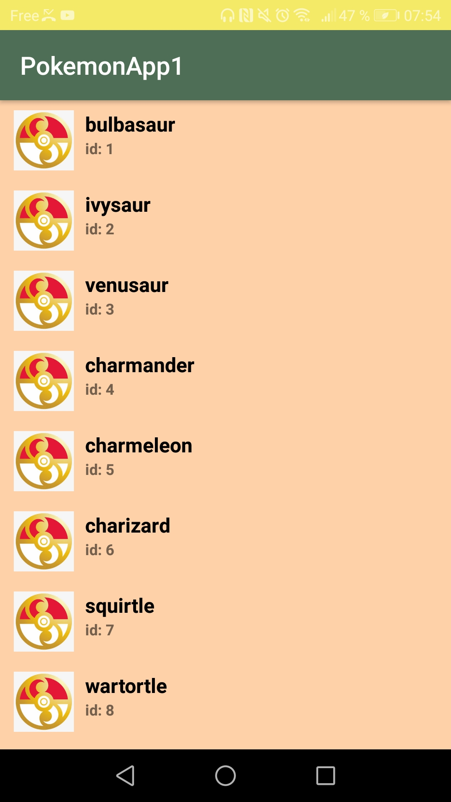
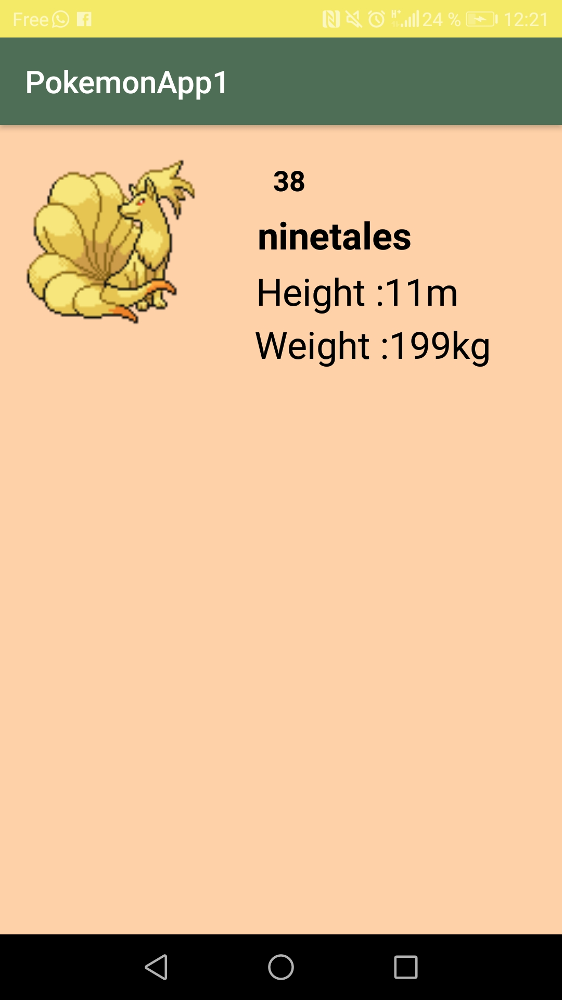

# PokemonApp1
##Présentation
PokemonApp1 est une application mobile codée en java qui affiche la liste des differents pokemons existant et diverses details les 
concernant (la taille, le poids, le nom et l'id). Ces diffenrentes information sont obtenues par le biais d'une API: **pokeapi.co**.
### Prérequis
- Installation d'Android Studio
- suivi des differents tutos ou cadlabs
-effectuer des recherches personnelles
### Consignes à respecter
-Deux ecrans: Un écran avec une liste et un écran avec un détail de l'item
-Appel à une API Rest pour récupérer de la donnée.
-Stockage des données en cache.
### Consigne respectée
-Deux ecrans: Un écran avec une liste et un écran avec un détail de l'item
-Appel à une API Rest pour récupérer de la donnée.
### Le Plus
-Architecture Logicielle (MVC, MVC ou MVVM).
-Gitflow
-Animation entre écrans
### Fonctionnalités
#### Ecran D'accueil
-cet ecran contient un boutton **GO!**. Si on clique dessus on passe a l'ecran suivant.

#### Ecran de la liste
-liste de 187 pokemons

#### Ecran des details
-on retrouve affiché ici les details des pokemons (nom, id, taille, poids).

#### Animations entre les ecrans 
-ecran 1-2
-ecran 2-3
#### TODO
-barre de recherche
-stockage en cache
